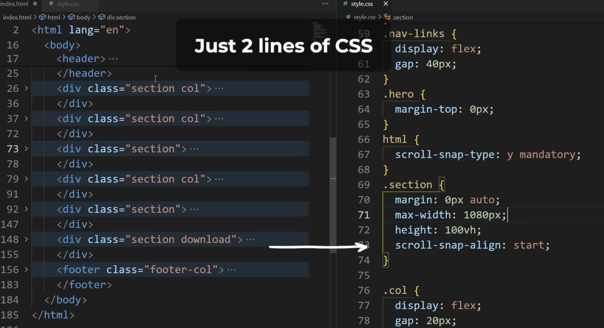

# TO DO

- do something related to networking as a project (some game)
- try to add particles.js
- are you nakul? (user auth)
- display projects
- ideas
- donation link
- calendar
- make the interface completely CRUD if signed in
- add discord, spotify links, chesscom
- add chess board
- front page: address recruiters, heading, sub heading, maybe some image and call to action (login/download resume)
- description: i am not selling anything here, just a fun website where i learn web dev by adding cool features that I want which happen to be free to use for others as well!
- maybe add a second accent colour
- maybe have accent colours as variables to make it easier to switch
- use max(36px, 4vw) typa css for dynamic font sizes
- use svg instead of pictures for footer (fontawesome)
- on gallery, if you click photo on the right, it expands to full dimension in the centre and rest gets translucent behind. clicking outside image after expanding goes back to default.
- add option to subscribe to mailing list. add option to send mailing list on admin login.
- on blogs, like [this website](https://camillemormal.com/about) make a scrollable mini view on the left and bigger view of specific blogs on right.
-> 
- try to add background (steal code from [here](https://github.com/kognise/website/blob/main/src/components/BackgroundEffect.astro)) and maybe also figure mailing list from here
